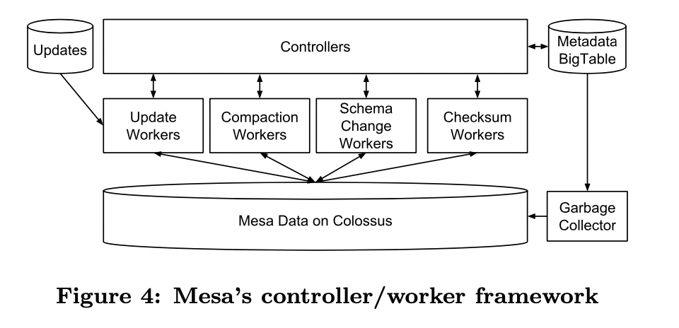

# Google Mesa论文解读
[论文地址](https://research.google/pubs/pub42851/)
## 1. Abstract
Pb级数据处理，百万级每秒的update吞吐能力，支撑每天十亿级的query查询。做到低延迟、多地域一致性
## 2. Introduction

阐述mesa的诞生场景。十亿级别的广告规模，内外部对广告数据都有细粒度的查询、分析需求。外部主要是广告商需要及时看到投放效果，内部是审计、分析、预测、预算、相关性等需求。该场景中，对数仓的具体需求如下  
1. update原子性
2. 数据强一致性、正确性
3. 高可用。没有单点故障
4. 近实时的update吞吐
5. 用户查询层面，要求低延迟、高吞吐。99分位延迟在百毫秒内
6. 可拓展性
7. 数据和元数据的变换。不影响原有表上的查询

Google有可以满足以上部分需求的数仓，但mesa是完全满足以上要求的方案，尤其针对业务核心数据

Mesa借鉴了Google已有的基础架构和服务，如Colossus，BigTable，MapReduce。 

 1. To achieve storage scalability and availability ：horizon- tally partitioned and replicated （比如按天partition，然后多地域复制）
 2. To achieve consistent and repeatable queries during updates: multi-versioned 
 3. To achieve update scalability: data updates are batched, assigned a new version number, and periodically incorporated into Mesa 
 4. To achieve update consistency across multiple data centers: a distributed synchronization protocol based on Paxos 
Bigtable, Spanner, F1等不符合场景。但是mesa借鉴了Bigtable和Paxos在元数据存储上的设计  
## 3. Mesa Storage Subsystem

### 3.1. The Data Model
Key，Value。value的每一列定义aggregation function

### 3.2. Updates and Queries
#### 3.2.1. batch update
1. 通过batch update来实现高更新吞吐量，通常更新频率几分钟一次。小而频繁的update意味着低延迟，但是资源消耗较高
2. 每个update指定一个版本号，从0开始
3. update，针对一个`(table，key)`的主键，最多只有一个`value`（需要提前按照`key`做好聚合）

#### 3.2.2. query
1. 一个query，包含版本号n和`谓词P`，`P`（sql 里的where条件）作用于key空间
2. Query只作用于`0～n`之间已完成的update
3. 以上算作Mesa的查询原语，所有复杂的查询都可以使用该原语通过预处理和后处理组合出来

#### 3.2.3. update示例
1. A、B表分别有两个version的update
2. A & B的两个update，也可以使用笛卡尔积后的一个update来更新。但是update中会冗余很多数据，维度特别多的时候，update成本昂贵

#### 3.2.4. 物化试图和query表示的table
不允许物化视图与父表有相同的列`aggregate function`。  可以直接用query表示一个新的table

#### 3.2.5. Update原子性
严格按照版本号顺序update，用户永远不会查询到update部分的数据

#### 3.2.6. 严格版本号顺序update的其他作用
1. Aggregate function操作，可能是不可交换的（比如在sum的列上，`A + B + C`，和`A + C + B`可能会带来不同的影响，尤其当B、C来自不同的update）
2. 可以使用对应的负value，后置update，更新之前如欺诈、作弊等update的value（比如先update了A，发现是作弊数据，后置新增一个-A update，消除该影响）

### 3.3. Versioned Data Management
#### 3.3.1. 版本管理的挑战

1. 独立存储每个版本成本很高
2. 查询时，遍历每个版本并汇总成本昂贵
3. 简单地在每次update时做版本预聚合，成本也很高

#### 3.3.2. 解决方案

1. Deltas
 - 代表预聚合的部分版本，用`[V1, V2]`表示。`V1 <= V2`。当`V1 == V2`时，可视为singleton deltas
 - Delta `[V1, V2]` 和 `[V2 + 1, V3]`可以合并为`[V1, V3]`。delta按照key有序排列，因此合并只需线性时间
 - 由于`aggregation function`不满足交换律，Delta聚合按照版本升序
2. Compaction
 - Base compaction：用户对指定版本的查询，只允许在指定时间内生效。意味着早于该指定时间的版本，会被聚合进base version。聚合后，该版本会被删除。这个过程称为base compaction
 - Cumulative compaction：base compaction尚不满足更新密集的table，因为base compaction的频率，赶不上新update（singleton）生产的速度。因此，可以对delta进行分级划分`{[0,B],[B+1,V1],[V1 +1,V2],...,[Vk +1,n]}` 。相比简单地使用singleton少了很多aggregation操作
 - delta compaction policy决定了：
    ```
    1) 哪些deltas必须在允许一个update版本被查询前同步生成
    2) 哪些deltas应该在update路径之外异步生成
    3) 什么时间一个delta可以被删除
    ```
3. two level delta compaction policy
* 分为base、cumulative 、singleton
* 当`B+10x` singleton合入时，cumulative `[B+1, B+10x]` 开始生成
* 新的base `[0, B’]`，每天计算一次。当然也需要B‘ singleton已经合入
* Mesa当前使用一个two level的变体multiple level

### 3.4. Physical Data and Index Formats
1. Delta一旦创建，是不可变的
2. Delta的不可变性允许Mesa使用一个相当简单的物理存储格式，需求具体如下：
    ```
    存储是mesa最大的开销，因此首要条件是节省存储空间
    为了支持快速查找指定key，需要有索引，每个索引按照其索引顺序对数据拷贝并排序
    ```

### 3.5. Format important aspects
1. delta在data file内部排序存储
2. rows按照row block组织，每个row block进行了转置和压缩，列式存储
3. 针对压缩算法，优先关注query / write相关的解压性能，而不是write相关的压缩性能
4. 前缀索引

## 4. Mesa System Architecture

### 4.1. Single Datacenter Instance
​

### 4.2. Update/Maintenance Subsystem 

#### 4.2.1. controller / Worker架构
**controller：元数据缓存、工作调度、工作队列管理**
1. Metadata包含：每个table的详细状态、执行原数据、关于delta files和update version的条目，delta compaction policy，按照操作类型细分的当前和历史操作记录
2. controller启动时从Bigtable中加载metadata，该metadata包含了归属于该mesa instance所有table的记录。每个table订阅了metadata feed来监听update，这些订阅会随着create table、drop table等操作动态变化。controller是metadata的排他writer
3. controller针对不同类型的work（如incorporating updates, delta compaction, schema changes, and table [checksums](https://en.wikipedia.org/wiki/Checksum) 等），维护了对应的内部队列。其中，incorporating updates, delta compaction这种特定在某个single mesa上执行的任务，由controller指派队列；像schema changes、table checksums这种需要全局协调、同步的work，由外部组件初始化

**Worker：实际负责数据操作**

1. 每种task类型有分离的worker池，可独立缩放。worker池的scheduler根据剩余空闲worker百分比来缩放worker数量
2. 空闲worker定期查询controller可被执行的任务，执行前会先validate，执行成功后通知controller。 task有对应的最大持有时间、[定期租期续约机制](https://www.cnblogs.com/yorkyang/p/9936637.html)（类似IP续租、心跳等，client向服务器申请租期，超过租期未续约视为节点失活），来确保slow和dead的worker不回永久占用task。当以上任一条件不满足时，controller可以重新将task分配给其他worker。有garbage collector持续地删除worker crash留下的脏文件
3. controller按照table分片，并且是无状态的，状态信息均存储于Bigtable中，因此controller是可拓展、高可用的

#### 4.2.2. Query Subsystem


1. Query servers：接收用户query，查询metadata确认数据存储在哪些文件中，即时执行aggregation，将查询出的数据从mesa内部格式转换为client支持的查询协议。   query servers的查询引擎只提供了条件过滤、group by等原语，高级的数据引擎基于这些原语提供更丰富的SQL
2. Mesa的客户端的需求各不相同，有的实时查询需要低延迟，有的离线查询需要高吞吐。Mesa保证了这些需求可以被恰当地标记，这些query servers使用这些标记来实现隔离、优化等机制
3. 在单Mesa实例中，query server被划分为多个集合，每个集合都服务于controller对应的所有table，这样可以简单地对query server灰度更新，不影响client的查询。 进而，为了提升性能，Mesa倾向于将相似的查询定向到同一个query server子集，这样就允许Mesa使用内存预取、缓存的技术来降低延迟，同时通过负载均衡来提供高吞吐
4. 启动时，query server向全局定位服务注册其主动缓存的表list。该定位服务用于client发现query server

### 4.3. Multi-Datacenter Deployment
​
#### 4.3.1. Consistent Update Mechanism

1. Committer主要是mesa全局实例范围内协调update，无状态，运行于多数据中心具体如下
 - 为update batch分配version number，发布update对应的metadata到versions database（一个基于Paxos一致性算法实现的全局复制一致性数据存储）
 - controllers 监听versions data中可用的update，将改update任务分配给update workers，成功后反馈给versions database
 - Committer持续地评估是否达到commit criteria（跨地域是否有足够多的mesa实例已经完成update合并）。这种机制保证了数据一致性。达到commit criteria后，committer将当前update的版本号发布为最新committed version，供新的查询使用
2. Conclusion
- query只针对committed version，且update分批执行，因此查询和更新都不用加锁
- update异步合并，metadata同步复制

#### 4.3.2. New Mesa Instances
1. 场景：instance新旧更换、table崩溃
2. Peer-to-peer加载机制：单独的load worker来执行，拷贝table数据。然后使用update worker追加最新的committed version

## 5. Enhancements
### 5.1. Query Server Performance Optimizations
1. delta剪枝优化：检查metadata，确认每个delta的key range。如果query中的filter（`where`）没有命中key range，则对应的delta可以直接剪枝。   该优化堆时间周期数据查询很有效，近期的查询可以剪纸掉base delta，历史的查询可以剪枝增量delta、singleton
2. scan-to-seek优化：filter即便没有命中索引前缀，也可以通过索引来优化查询。例如：某table的索引列为A和B，filter B=2没有命中索引前缀，但是也不至于扫全表。A取任意值时（比如`A=1, 4`），query server跳过`A = 1且B < 2`直接定位到A=1且B=2，以及跳过`A=4且B<2`直接定位到`A=4且B=2`
3. resume key：mesa流式地向client返回数据，一次返回一个block。当query server无响应时，client可以透明地切换到另一个query server，从resume key开始恢复查询。而不是从头开始。 云环境里实例很容易掉线，这种机制仍然可以可靠性和可用性
### 5.2. Parallelizing Worker Operation
1. 使用MapReduce框架并行执行。delta中每s行预设一个采样key，Mapreduce的partition划分，主要利用采样key，对update、query等覆盖的delta集合进行划分
2. s设定期望：不能太小，否则mapreduce启动器划分时读入采样数据太多；也不能太大，导致单个partition超过阈值，影响整体并行执行效率。具体：
* m个delta，n行数据，想要划分为p个partition
* 理想情况：每个partition划分n/p行数据
* 实际：每个partition增量计入s，直到行数超过`n / p`。s大小无法保证刚好等于n/p。这样划分下来，总体最大误差为`(m - 1)s` (为啥不是ms？？不理解)。所以单个partition最大为 `n/p + (m - 1)s`。（观察得到）m一般不大，所以s可以设大点，p设小点，从而达到s的设定期望

### 5.3. Schema Changes in Mesa
1. 简单粗暴但昂贵的方法1：拷贝新schema对应的副本，并行执行update，直到新schema
2. 只适用于常见情况的优化方法2 - Linked Schema Change：新的schema立即生效，查询、更新中涉及到shcema change新增列的，使用该列的默认值。不适用于更改了已有列的schema change情况

### 5.4. Mitigating Data Corruption Problems
1. 概述：在Mesa的体量下，CPU或者RAM带来的计算错误，都是不可忽视的，需要
2. 单机
- 在线检查（发现计算错误）：查询和更新的时候都会check，从row ordering、key range、aggregate value三个角度，发现异常后重试
- 离线
  - 全局index checksum，包括强行序依赖的checksum、弱行序依赖的checksum
  - 轻量离线检查：检查不同索引、实例间的checksum。基于metadata，更高效

## 6. Experience & Lessons Learned

1. 分布式、并行性和云计算：云计算 + 去中心化架构 + 并行计算，可以在普通的多机环境上，实现打平定制化架构的运行性能
2. 模块化、抽象和分层架构：虽然有性能损失，但是分层架构可以更好地适应系统复杂性。举例：Mesa建立在Cosossus（类似HDFS）和BigTable之上，可以专注于Mesa的架构，而不是从裸机上设计整个系统
3. 容量规划：云计算可以简化很多容量规划的工作
4. 应用层假设：应该尽可能笼统设计，减少对当下和未来应用层假设的依赖。举例：Mesa的前身假设schema change会很少使用，并且基于此假设做了系统设计，事实证明是错误的
5. 跨地域拷贝：不仅保障了数据和系统可用性，也为运维带来好处。可以低成本的从运行中断中恢复
6. 数据损坏和组建故障：有很多原因导致故障，并需要做预防和监控。还有很多难以检测到的错误，尤其在云计算环境里，无法定位到故障机器
7. 测试和持续部署：基本的工程实践（单元测试等） + Mesa整体容错架构和数据损坏恢复能力，保障了Mesa在新功能迭代过程中保持生产环境的稳定
8. 人为因素：庞大、持续有新人加入的工程师队伍，通过code clarity、单元测试、文档、运维演练、子系统交叉训练等方式预防

## 7. Mesa Production Metrics

1. 更新、查询的吞吐量够大！图7、8、9
2. 查询延迟够小，且不由于数据量、CPU的增长受影响：图8、图11
3. query servers与支持的query吞吐量呈线性增长。并没有明显地边际递减效应：图10


